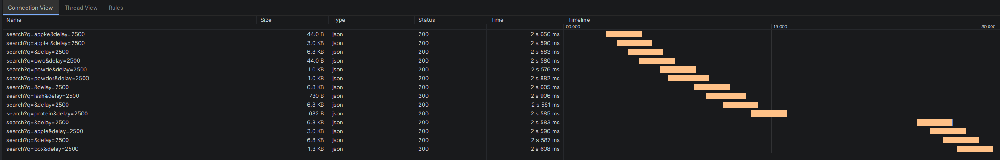
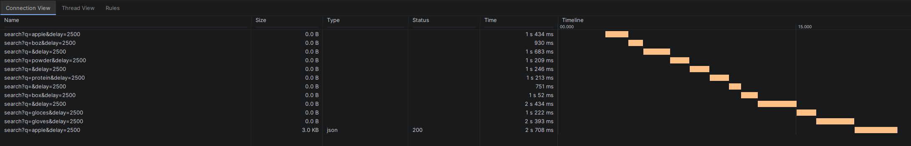

## Flow operators

### .debounce(Duration)
we wait for the flow to stop updating values for the duration and after that only proceed (to avoid spam with values)

### .distinctUntilChanged()
checks for the flow to have actually new value compared to previous one to avoid transforming the same value few times

### .flatMapMerge { ... }
on every query update flow triggers API request even if it was not finished we will get response and it will show all of the responses and it can be even in the wrong order so data can be irrelevant for the user

### .flatMapLatest { ... }
on every query update flow triggers API request as well, BUT if it was not finished it is just canceled and we only have one last alive with only one response
